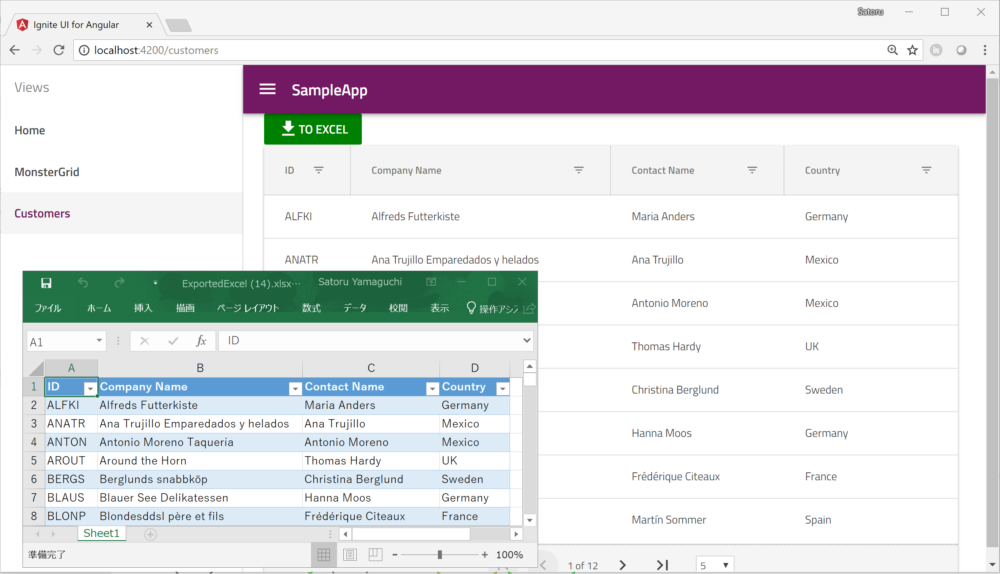
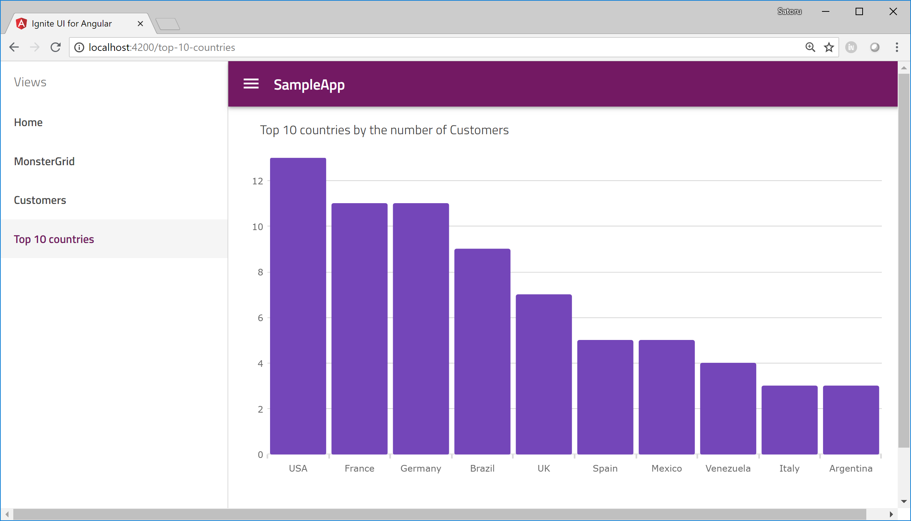

# Ignite UI for Angular hands-on workshop

## About this workshop

This workshop is for those who want to try IgniteUI for Angular or who are looking for rich and fast UI components which can be used in Angular app. You can experience how to build Angular app with Ignite UI for Angular and its productivity through this workshop.

## New to Angular?

You are new to Angular? Don't worry about that, this workshop is easy to start. You can also learn a little bit about basic of Angular through the workshop. If you are expert of Angular, just use copy & paste for the Angular basic stuff and focus on how to use Ignite UI components.

## What you build through the workshop

Through this workshop you generate a new Angular project from scratch, you get data from a Wev Service and then show them with some Ignite UI for Angular components.

## Application for the workshop

Download the copy of this repository and find Angular projects in igniteui-angular-workshop/src.

 - 01-Before/MyIgApp Use this project if you got any trouble in using Ignite UI CLI. This project is the expected result when you completed [01 Generate Angular project with Ignite UI CLI](docs/01-Generate-Angular-project.md). 
  - 02-After/MyIgApp Use this project to see the final result of the workshop. This project is the expected result when you completed [09 Use igx-category-chart](docs/09-Use-igx-category-chart.md).

## Check Environment
To proceed this hands-on workshop you need the environments listed in the following page.

[Environment](docs/00-Environment.md)

## Steps

0. [Environment](docs/00-Environment.md)
1. [Generate Angular project with Ignite UI CLI](docs/01-Generate-Angular-project.md)
2. [Add Component](docs/02-Add-Component.md)
3. [Add Service and call it from Component](docs/03-Add-Service-and-call-it-from-Component.md)
4. [Use HttpClient to get data from API](docs/04-Use-HttpClient-to-get-data-from-API.md)
5. [Use igx-grid](docs/05-Use-igx-grid.md)
6. [Export Excel](docs/06-Exporting-Excel.md)
7. [Add Component for displaying chart](docs/07-Add-Component-for-displaying-Chart.md)
8. [Use lodash to generate the top 10 countries](docs/08-Use-lodash-to-generate-top-10-countries.md)
9. [Use igx-category-chart](docs/09-Use-igx-category-chart.md)

## Next

[Environment](docs/00-Environment.md)