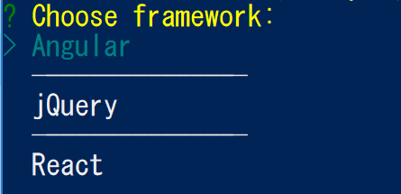
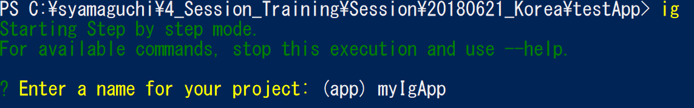

# Generate Angular project with igniteui-cli

The shortest path to bootstrap an Angular app with Ignite UI components is to use the Ignite UI CLI. In this section you'll generate a new Angular app which is already configured with some views and components using Ignite UI for Angular.

** Of cause you can generate Angular app and manually add dependencies of Ignite UI for Angular instead of using igniteui-cli.  

 which builds a configured app that the developer can get up and running with the ease of two commands. First, you need to 

## Install Ignite UI CLI
If you haven't install the Install the Ignite UI CLI, install it with the following command on Terminal, Command Prompt or Power Shell.

```sh
$ npm install -g igniteui-cli 
```

## Generate Angular App with igniteui-cli command

On a folder you want to create application, generate a new Angular app with the following igniteui-cli command "ig".

```sh
$ ig 
```

The cli would ask you about the application name, please enter the name you like and hit the enter key




[Ignite UI for Angular を開始 (Ignite UI CLI利用)](https://jp.infragistics.com/products/ignite-ui-angular/getting-started#tab-ignite-ui-cli)

※１ Ignite UI CLI：インフラジスティックスが提供する、Ignite UI のインストール/インポートやそれらを使ったViewの作成を簡単に実現するためのCLIツールです。内部的に Angular CLI が使われています。

手順が完了し、アプリが動作すると以下の結果となります。



MonsterGridを選択して、どんな事ができるのか UI を触ってみましょう。

## 補足

Ignite UI CLI を利用せずに Angular CLI を利用して一からAngularプロジェクトの作成 ～ Ignite UI for Angular のインストールまで行う場合は、以下のWebページをご参考にして下さい。

[Ignite UI for Angular を開始 (npm利用)](https://jp.infragistics.com/products/ignite-ui-angular/getting-started#tab-npm)

## Next

[02-Componentの追加](02-Componentの追加.md)
