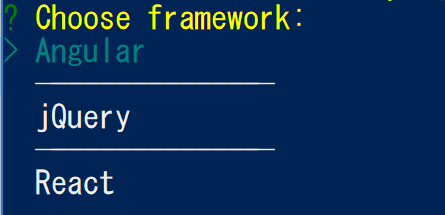
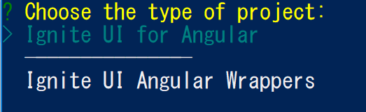
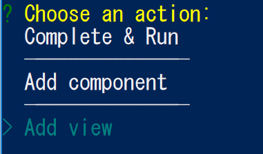
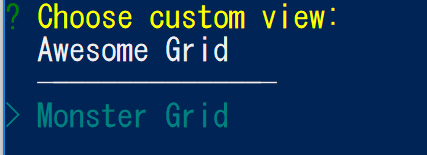
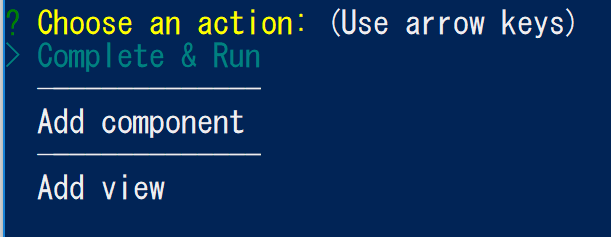
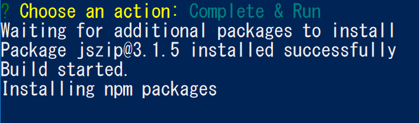
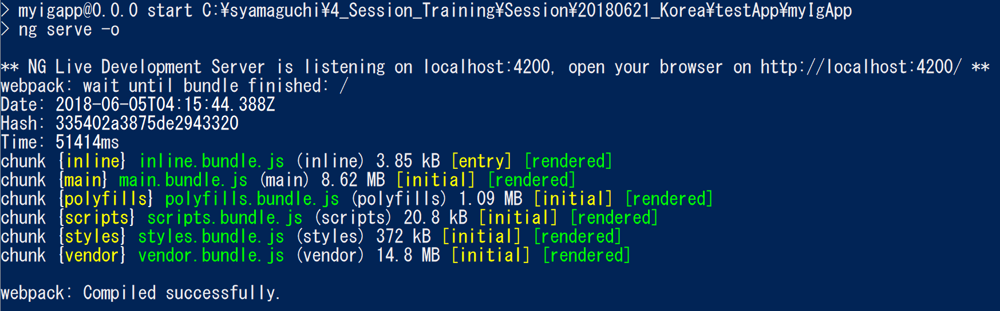
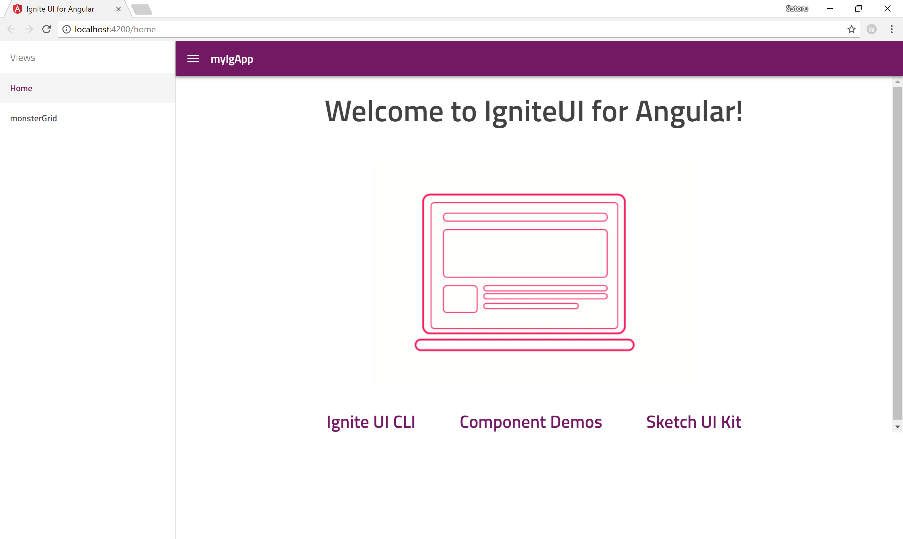
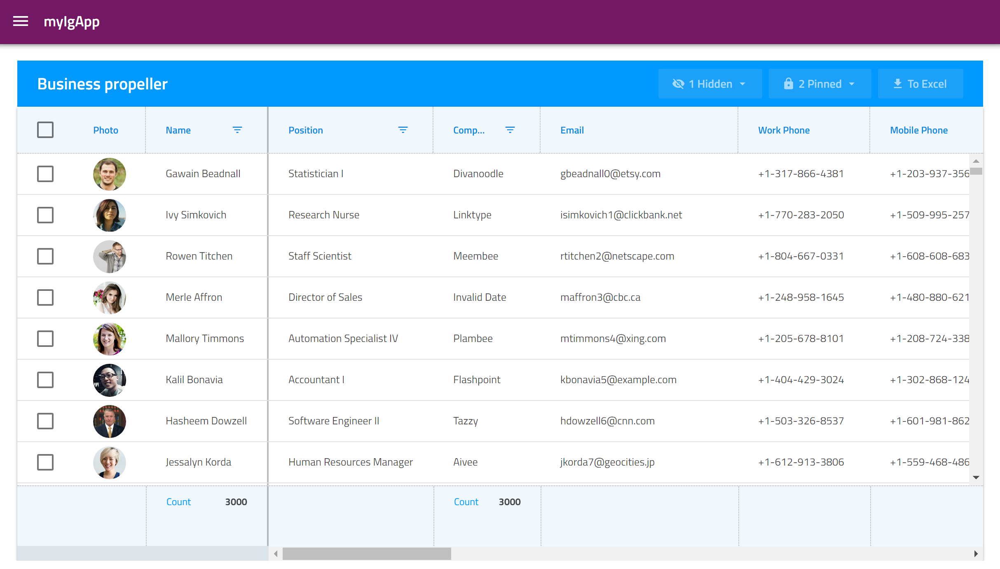

# Generate Angular project with igniteui-cli

The shortest path to bootstrap an Angular app with Ignite UI components is to use the Ignite UI CLI. In this section you'll generate a new Angular app which is already configured with some views and components using Ignite UI for Angular.

** Of cause you can generate Angular app and manually add dependencies of Ignite UI for Angular instead of using igniteui-cli.  

 which builds a configured app that the developer can get up and running with the ease of two commands. First, you need to 

## Install Ignite UI CLI
If you haven't install the Install the Ignite UI CLI, install it with the following command on Terminal, Command Prompt or Power Shell.

```sh
$ npm install -g igniteui-cli 
```

## Generate Angular App with igniteui-cli command

On a folder you want to create application, generate a new Angular app with the following igniteui-cli command "ig".

```sh
$ ig 
```

The cli would ask you about the application name, please enter the name you like and hit the enter key


Select Angular and hit the enter key.



Select "Ignite UI for Angular" and hit the enter key.



Select "Add view" and hit the enter key.



Select "Monster Grid" and hit the enter key.



Type the view name you like and hit the enter key.


Select "Complete & Run" and hit the enter key.



Then igniteui-cli start generating new Angular project and installing all dependencies to the project. This may take long because dependencies



Once npm got all dependencies, the cli will build the application, launch it on the web server and then the web browser will automatically open to show the angular app you just created.



You would see the application like images below on your default browser.





[Ignite UI for Angular を開始 (Ignite UI CLI利用)](https://jp.infragistics.com/products/ignite-ui-angular/getting-started#tab-ignite-ui-cli)

※１ Ignite UI CLI：インフラジスティックスが提供する、Ignite UI のインストール/インポートやそれらを使ったViewの作成を簡単に実現するためのCLIツールです。内部的に Angular CLI が使われています。

## Note: Going with Angular CLI ? 

The project you created has the same instructure as one created by Angular CLI, because Ignite UI CLI is using Angular CLI inside. If you want to go with Angular CLI instead of Ignite UI CLI then check the following page and scroll down to the middle of the page. 

[Getting started with Ignite UI for Angular](https://www.infragistics.com/products/ignite-ui-angular/getting-started)

## Next

[02 Add Component](02-Add-Component.md)
