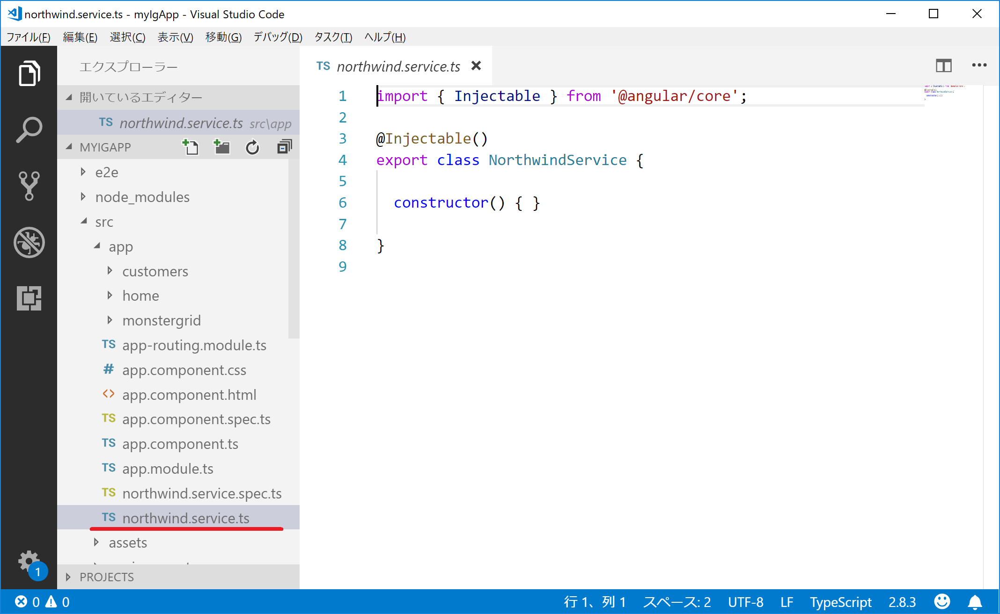
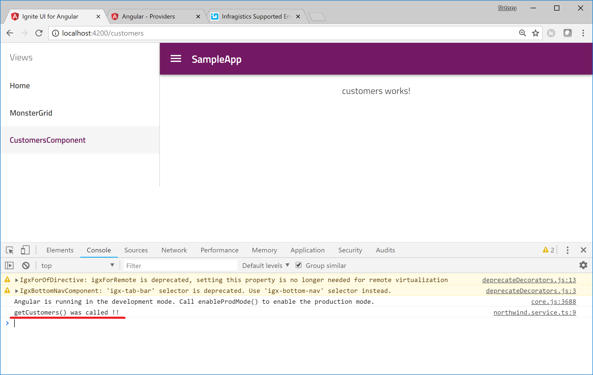

# Add Service and call it from Component

In this section you generate a new service to get data from the web searvice and then call it from the customers component.

## Steps
1. Service の生成
2. Service の登録と DI
3. Service の利用
4. 実行結果の確認

## Generate northwind Service 

Generate a new component named "northwind" with "ng generate" commnad.

Console

```sh
$ ng generate service northwind
```
Then Angular CLI generates northwind-service.ts under the app folder.



    Note that the codes in the service.ts might be different depending on the Anguler version.

## Registering the service and DI

    Note:
    If your project is based on Angular 6 or later (if you are used igniteui-cli v1.3.2 or later) you can skip this step because Angular CLI automatically set providedIn: 'root' in the @Injectable decorator which allows you to use the service without explicitly registering it in a component / module.

To use a service in a component (with Angular 5 or earlier) you need to register a service into a component or a module. 

Open app.module.ts and add NorthwindService to the providers.

app\app.module.ts

```ts
...
import { NorthwindService } from './northwind.service';
...
@NgModule({
  ...
  providers: [IgxExcelExporterService,
    NorthwindService],
})
...
```

To use the northwind service in the customers component, inject the dependency of the service into the component like the code below, which is called DI(Dipendency Injection), so that you can recieve the instance of the service and use it in the component. 

app\customers\customers.component.ts

```ts
import { NorthwindService } from '../northwind.service';
...
export class CustomersComponent implements OnInit {
  constructor(private northwindService: NorthwindService) { }
  ngOnInit() {
  }
}
...
```

## Use the service

Let's add getCustomers() method inside the northwind service. In this section, just output a message in the console so that you can know the method got called. And then call it inside ngOnInit in the customers component.

app/northwind-service.ts

```ts
...
export class NorthwindService {

  constructor() { }

  getCustomers(): void {
    console.log("getCustomers() was called !!");
  }
}
```

app\customers\customers.component.ts


```ts
...
  constructor(private northwindService: NorthwindService) { }

  ngOnInit() {
    this.northwindService.getCustomers();
  }
...
```

This should result that getCustomers() is called when the customers component gets initialized and then the browser console shows the massage "getCustomers() was called !!"


## Check the result

Check the result with the following ng command.

Console

```sh
$ ng  serve
```



Now the northwind service gets called from the customers component. Next step is to connect to the web service to get customers records in the service.

## Note

If you want to learn about Angular DI please check [Angular Document Dependency Injection](https://angular.io/guide/dependency-injection-pattern) 

## Next
[04-APIからテーブル一覧を取得](04-APIからテーブル一覧を取得.md)
