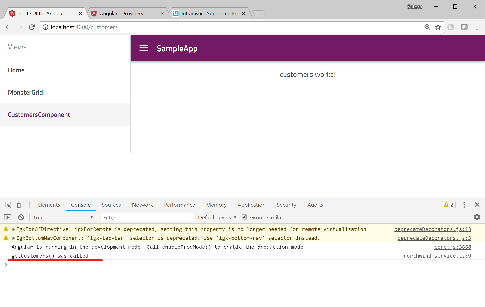

# Service の追加と利用

ここでは、APIからデータを取得するための Service を追加し、Component からその Service を呼び出すところまで進めます。

## 目的
- Service の追加方法を学習します。
- Service を利用する方法 (Providersへの登録 / Dipendency Injection) を学習します。

## 手順
1. Service の生成
2. Service の登録と DI
3. Service の利用
4. 実行結果の確認

## Service の生成

まず、ng generate コマンドで apiServer という名前の Service を作成します。

console

```sh
$ ng generate service api-server
```
すると Angular CLI が App フォルダ配下に api-server-service.ts を作成してくれます。


## Service の登録と DI

続いて、生成した Service を利用できるようにします。Angular 6 以降では @Injectable デコレータの中でサービスのスコープを指定する方式が初期状態となりますが、 Angular 5 以前では Module または Component の Provider へ個別に登録する必要があります。 

今回は　Component の Provider へ作成した Service を登録します。api-server-service.ts を開いて以下のように、import ステートメントの追加とProviders へ ApiServerService を追加します。<br>※ Angular 6 以降では以下のコード（Providers への登録）は必要ありません。

app\api-server-tables\api-server-tables.component.ts

```ts
import { Component, OnInit } from '@angular/core';
import {ApiServerService} from '../api-server.service'

@Component({
  selector: 'app-api-server-tables',
  templateUrl: './api-server-tables.component.html',
  styleUrls: ['./api-server-tables.component.scss'],
  providers: [ApiServerService]
})

・・・
```
これで、ApiServerTablesComponent の中で ApiServerService が提供可能な状況になりました。

続いて、提供可能なサービス ApiServerService のインスタンスを ApiServerTablesComponent の中で受け取るために DI (Dependency Injection) します。

以下のようにコンストラクタの中で apiServerService を定義し、ApiServerServiceのインスタンスを受け取ります。

app\api-server-tables\api-server-tables.component.ts

```ts
・・・
  constructor(private apiServerService: ApiServerService) { }
・・・
```

これで ApiServerService が ApiServerTablesComponent の中で利用できるようになりました。

## Service の利用

早速サービスを利用してみましょう。

サービス側で、getTables() 関数を追加しましょう。この関数が呼ばれた時に、呼ばれたことがわかるようにコンソールに出力します。

app/api-server-service.ts

```ts
・・・
export class ApiServerService {

  constructor() { }

  getTables(): void {
    console.log("getTables() was called !!");
  }
}
・・・
```

続いて、コンポーネント側で getTables() 関数を呼び出してみましょう。

```ts
・・・
  constructor(private apiServerService: ApiServerService) { }

  ngOnInit() {
    this.apiServerService.getTables();
  }
・・・
```

これで、ApiServerTablesComponentが初期化された際に、getTables() が呼び出されコンソールにその旨が出力されるはずです。


## 実行結果の確認

ng serve コマンドで実行結果を確認してみましょう。

console

```sh
$ ng  serve
```



これで ApiServerTablesComponent の中で ApiServerService の関数を呼び出せていることが確認できました。次はサービスの中で実際に API からテーブルの一覧を取得します。

## 補足
[Angular 公式ドキュメント Dependency-Injection](https://angular.io/guide/dependency-injection-pattern) 

## Next
[04-APIからテーブル一覧を取得](04-APIからテーブル一覧を取得.md)
