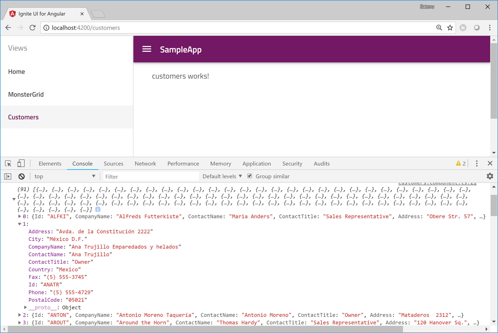

# Get data with HttpClient

In this section, you get customers records from Northwind Web Service by using Angular HttpClient and then display them in the customers component.

Customers records:
[http://northwind.servicestack.net/customers](http://northwind.servicestack.net/customers)

customers.json:
[http://northwind.servicestack.net/customers.json](http://northwind.servicestack.net/customers.json)

## Import HttpClientModule

Import HttpClientModule in the app.module.ts so that you can use HttpClient in your Components.

app\app.module.ts

```ts
...
//Add
import { HttpClientModule } from '@angular/common/http';
...

...
  imports: [
    HttpClientModule,  //Add
    FormsModule,
...
```

## Get customers through HttpClient

Let's get customers records as json data from Northwind Web Service through HttpClient.

Open northwind-service.ts and do
 - import HttpClient and Observable
 - DI of HttpClient
 - use get() method to get data from the baseUrl

app/northwind-service.ts


( If you are using Angular6 )
```ts
import { Injectable } from '@angular/core';
import { HttpClient } from '@angular/common/http'; //Add
import { Observable } from 'rxjs/Observable'; //Add

@Injectable()
export class NorthwindService {
  private baseUrl = 'http://northwind.servicestack.net/customers.json'; // API End Point

  constructor(private http: HttpClient) {
   }

   getCustomers(): Observable<any> {
    return this.http.get<any>(this.baseUrl)
    .map(res => {
      return res.Customers as any;
    });
   }
}
```

( If you are using Angular5 or lower)

```ts
import { Injectable } from '@angular/core';
import { HttpClient } from '@angular/common/http'; //Add
import { Observable } from 'rxjs'; //Add
import { map } from 'rxjs/operators'; //Add

@Injectable({
  providedIn: 'root'
})
export class NorthwindService {
  private baseUrl = 'http://northwind.servicestack.net/customers.json'; // API End Point

  constructor(private http: HttpClient) {
   }

  getCustomers(): Observable<any> {
    return this.http.get<any>(this.baseUrl)
      .pipe(
        map(res => {
          return res.Customers as any;
        })
      );
   }
}

```

HttpClient.get() method returns Observable<T>. In the real world app it should be better to define data models to recieve data, but you don't have to do it and use "any" in this workshop just for making it simple.

## Recieve data in a Component
Open customers.component.ts and modify it as below.

app\customers\customers.component.ts

```ts
...
export class CustomersComponent implements OnInit {

  customersTable: Object[] = null;

  constructor(private northwindService: NorthwindService) { }

  ngOnInit() {
    this.northwindService
      .getCustomers()
      .subscribe(
        data => {
          this.customersTable = data;
          console.log(this.customersTable);
        }
      );
  }
}
...
```

After saving the files you modified, check the result with the following ng command. If the app is already running, just save all files you changed then the page would get reflesh and show the result.



Now you have json data from API in Component. Next you make a rich grid UI with Ignite UI grid component bound to the data from API.

## Next

[05 Use igx-grid](05-Use-igx-grid.md)