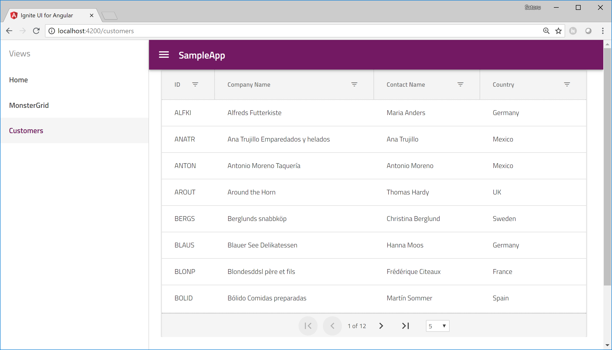

# Use igx-grid
In this section, you use igx-grid to display customers data got from API with some features like forting and filtering.

## Ignite UI for Angular 利用準備の確認

To use Ignite UI components in your project you need to import each modules corresponding to components you use, but you already have them because they are imported automatically when you generate this project with Ignite UI CLI.

Open app.module.ts and check Ignite UI components are already imported. 


```ts
...
import { IgxNavigationDrawerModule, IgxNavbarModule, IgxLayoutModule, IgxRippleModule, IgxGridModule, IgxAvatarModule, IgxBadgeModule, IgxButtonModule, IgxIconModule, IgxInputGroupModule, IgxProgressBarModule, IgxSwitchModule, IgxToggleModule, IgxCheckboxModule } from 'igniteui-angular/main';
...

@NgModule({
  ...

  imports: [
    ...

    IgxNavigationDrawerModule,
    IgxNavbarModule,
    IgxLayoutModule,
    IgxRippleModule,
    IgxGridModule.forRoot(),
    IgxAvatarModule,
    IgxBadgeModule,
    IgxButtonModule,
    IgxIconModule,
    IgxInputGroupModule,
    IgxProgressBarModule,
    IgxSwitchModule,
    IgxToggleModule,
    IgxCheckboxModule
  ],

```

## Use igx-grid

Open customers.component.html and modify as below.

app/customers/customers.component.html

```html
<igx-grid #grid id="grid1" [data]="customersTable" [autoGenerate]="false"
 width="800px" height="505px" [paging]="true" [perPage]="8">
  <igx-column field="Id" header="ID" [sortable]="true" [filterable]="true" width="100px"></igx-column>
  <igx-column field="CompanyName" header="Company Name" [sortable]="true" [filterable]="true" width="300px"></igx-column>
  <igx-column field="ContactName" header="Contact Name" [sortable]="true" [filterable]="true" width="200px"></igx-column>
  <igx-column field="Country" header="Country" [sortable]="true" [filterable]="true" width="200px"></igx-column>
</igx-grid>
```

If you have time to configure more, please reffer the API refenrece and do some more configulation.

[Sample and API for igx-grid](https://www.infragistics.com/products/ignite-ui-angular/angular/components/grid.html)

## Check the result

Save the files you changed and check the result.




## Next

[05-APIからテーブルデータを取得](05-APIからテーブルデータを取得.md)
