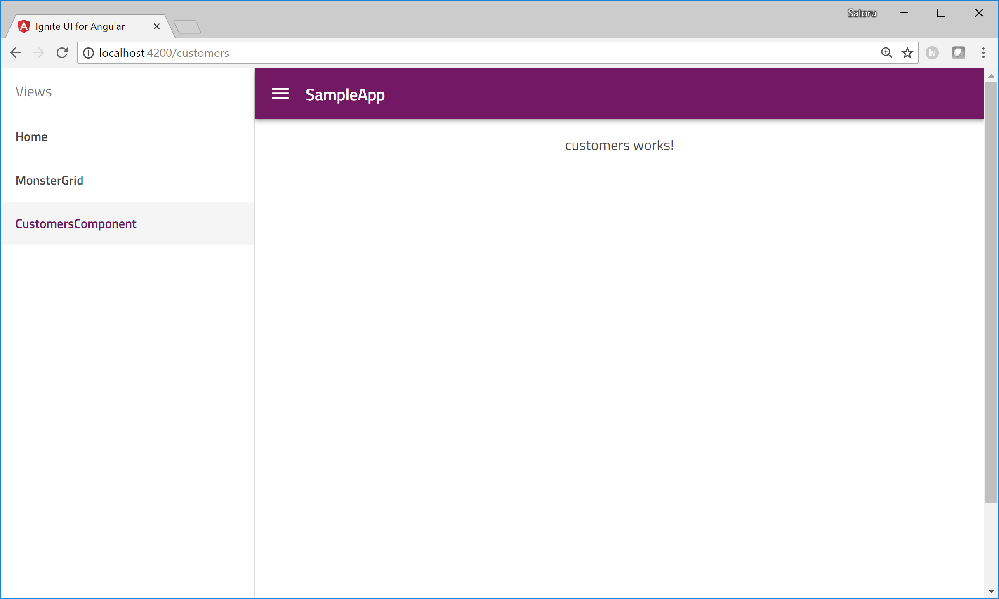

# Add Component

In this section you create a new component to display customer records got from Northwind web service with Angular CLI commands.

## 目的
- Component の追加方法を学習します。
- Angular CLIをベースとしたアプリケーションの実行方法・確認方法を学習します。

## Steaps
1. Generate customers component
2. Set the routing to the component
3. Check the result

## Generate customers component

Generate a new component named "customers" with "ng generate" commnad.

Console

```sh
$ ng generate component customers
```

Then the cli generate a folder and files regarding the "customers" component under the "app" folder.

## Set the routing to the customers component

You have already routing mechanism in the application which igniteui-cli created when you executed the ig command. It shows the registered routes as menu items on the left side menu bar and also it can navigate to a component when user click a menu item.

Open app/app-routing.module.ts and import customers component and add it to the routes. 

app/app-routing.module.ts

```ts
import { NgModule } from '@angular/core';
import { Routes, RouterModule } from '@angular/router';
import { HomeComponent } from './home/home.component';
import { MonsterGridComponent } from './monstergrid/monstergrid.component';
import { CustomersComponent } from './customers/customers.component';

export const routes: Routes = [
  { path: '', redirectTo: '/home', pathMatch: 'full' },
  { path: 'home', component: HomeComponent, data: { text: 'Home' } },
  { path: 'monstergrid', component: MonsterGridComponent, data: { text: 'MonsterGrid' } },
  { path: 'customers', component: CustomersComponent, data: { text: 'Customers' } }
];

...
```
## Check the result

After saving the files you modified, check the result with the following ng command. It builds your Angular app and put it on a test web server to see the result on your browser.

console

```sh
$ ng  serve
```
"customers" is added on the left side menu and if you click it then it navigate to the customers component.



Now you have a component to display customers data got from Northwind Web Service. Next step is to create a service to get data from web searvice.

## Note
Learning Angular basic architecture like Component, Routing and Navigation is out of scope on this workshop. If you want to learn them please check [Angular Documentation Routing & Navigation](https://angular.io/guide/router).


## Next
[03-Serviceの追加と利用](03-Serviceの追加と利用.md)


