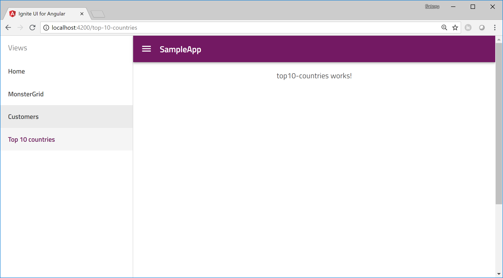

# Add component for displaying chart

In this section you create a new component to display the top 10 countries by the number of customers on a chart.

## Generate customers component

Generate a new component named Top10Countries with "ng generate" commnad.

Console

```sh
$ ng generate component Top10Countries
```

Then the cli generate a "top-10-countries" folder and files regarding the component under the "app" folder.

## Set the routing to the Top10Countries component

Open app/app-routing.module.ts and import Top10Countries component and add it to the routes. 

app/app-routing.module.ts

```ts
import { NgModule } from '@angular/core';
import { Routes, RouterModule } from '@angular/router';
import { HomeComponent } from './home/home.component';
import { MonsterGridComponent } from './monstergrid/monstergrid.component';
import { CustomersComponent } from './customers/customers.component';
import { Top10CountriesComponent } from './top10-countries/top10-countries.component';

export const routes: Routes = [
  { path: '', redirectTo: '/home', pathMatch: 'full' },
  { path: 'home', component: HomeComponent, data: { text: 'Home' } },
  { path: 'monstergrid', component: MonsterGridComponent, data: { text: 'MonsterGrid' } },
  { path: 'customers', component: CustomersComponent, data: { text: 'Customers' } },
  { path: 'top-10-countries', component: Top10CountriesComponent, data: { text: 'Top 10 countries' } }
];
...
```

## Check the result

After saving the files you modified, check the result with the following ng command.

console

```sh
$ ng  serve
```



Now you have a component to display top 10 countries on a chart. Next step is to prepare top 10 countries data.


## Next

[08 Use lodash to generate the top 10 countries](08-Use-lodash-to-generate-top-10-countries.md)


