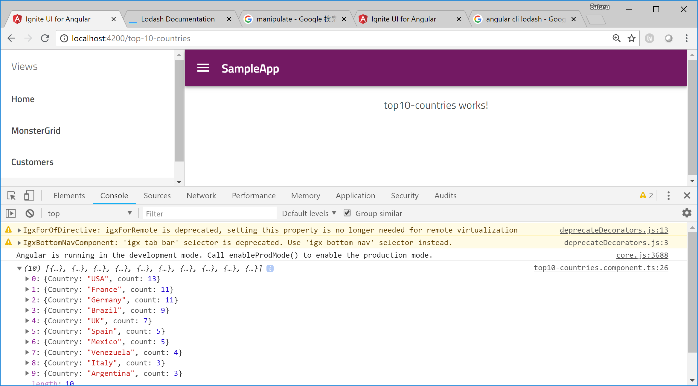

# Prepare the top 10 countries data
In this section, you generate the top 10 countries based on customers data got through the getCustomers() method.

## Get customers

Get customers data through getcustomers() method in NorthwindService as same as you did in the [section 4](04-Use-HttpClient-to-get-data-from-API.md)

Open top10-countries.component.ts and modify the code as below. 

app/top10-countries/top10-countries.component.ts

```ts
import { Component, OnInit } from '@angular/core';
import { NorthwindService } from '../northwind.service';

@Component({
  selector: 'app-top10-countries',
  templateUrl: './top10-countries.component.html',
  styleUrls: ['./top10-countries.component.scss']
})
export class Top10CountriesComponent implements OnInit {

  constructor(private northwindService: NorthwindService) { }
  top10Countries: Object[] = null;

  ngOnInit() {
    this.northwindService
      .getCustomers()
      .subscribe(
        data => {
          this.top10Countries = data;
          console.log(this.top10Countries);
        }
      );
  }
}
```

## Import lodash to manipulate data

You would like to count the number of customers by countries to make the top 10 list. To achieve it you would be able to write code, but it would take some and the code would not be simple. In that case let's use lodash which is a popular library to easiliy do grouping, filtering, sorting and other data manipulation.

Open top10-countries.component.ts and import loadsh

app/top10-countries/top10-countries.component.ts

```ts
import { Component, OnInit } from '@angular/core';
import { NorthwindService } from '../northwind.service';
import * as _ from 'lodash';

...
```

Note that lodash get installed when Angular CLI generates the new project, so you don't have to npm intall lodash.

## Use lodash

Group by "country" and sort it by the number of countries and then extract the top 10 records, by using lodash.

app/top10-countries/top10-countries.component.ts

```ts
...
  ngOnInit() {
    this.northwindService
      .getCustomers()
      .subscribe(
        data => {
          var result = _(data)
            .groupBy('Country')
            .map(function (items, Country) {
              return { Country: Country, count: items.length };
            }).value();
          this.top10Countries = _.orderBy(result, 'count').reverse().slice(0, 10);
          console.log(this.top10Countries);
        }
      );
  }
...
```

## Note

lodash is not reagrding Infragistics products though, if you want to know more about lodash please check the lodash documents.

[lodash documents](https://lodash.com/docs)

## Check the result

Save the files you changed and check the result.




## Next

[09 Use igx-category-chart](09-Use-igx-category-chart.md)
