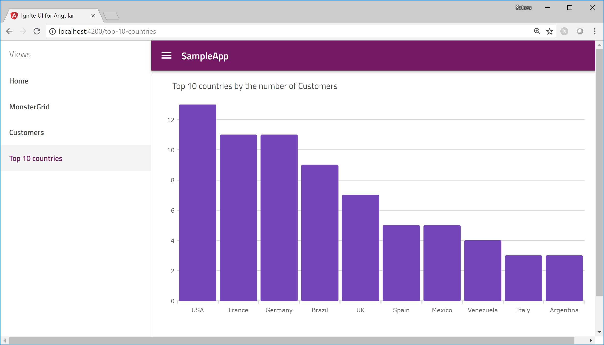

# Use igx-category-chart
In this section, you use igx-category-chart to display the top 10 countries by the number of customers on a chart.

## Install igx-category-chart

To use igx-category-chart you need to instal igniteui-angular-charts which is separated repository from igniteui-angular. If you didn't choose chart view when you generated the project with Ignite UI CLI then you need to install igniteui-angular-charts with the following command.

Console

```sh
npm install igniteui-angular-charts --save-dev
```

## Import igx-category-chart

To use igx-category-chart you need to import it in a module. Open app.module.ts and import it. 

app/app-routing.module.ts

```ts
...
import { IgxCategoryChartModule } from 'igniteui-angular-charts/ES5/igx-category-chart-module';

...

@NgModule({
  ...

  imports: [
    ...
    IgxToggleModule,
    IgxCheckboxModule,
    HttpClientModule,
    IgxCategoryChartModule
  ],

```

## Use igx-category-chart

Open customers.component.html and modify as below.

app/top10-countries/top10-countries.component.html

```html
<p>
    Top 10 countries by the number of Customers
</p>
<igx-category-chart [dataSource]="top10Countries"
                   width="800px"
                   height="500px"
                   yAxisMinimumValue="0">
</igx-category-chart>
```

If you have time to configure more, please reffer the API refenrece and do some more configulation to igx-category-chart, like changing 

[Sample and API for igx-category-chart](https://www.infragistics.com/products/ignite-ui-angular/angular/components/categorychart_configuration_options.html)

## Check the result

Save the files you changed and check the result.




## Next

[05-APIからテーブルデータを取得](05-APIからテーブルデータを取得.md)
